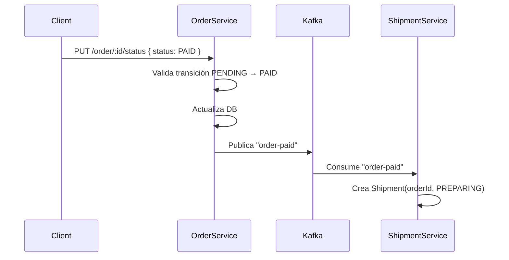

# Order Service

Microservicio de gestión de órdenes para el e-commerce.

## Descripción

Este servicio gestiona el ciclo de vida completo de las órdenes de compra:
- Creación de órdenes con validación de productos
- Listado y consulta de órdenes
- Actualización de estado (PENDING → PAID → PREPARING → SHIPPED → CANCELLED)
- **Publicación de eventos Kafka cuando una orden se marca como PAID**
- Integración con product-service para validación de productos y precios
- Persistencia en PostgreSQL con Prisma ORM
- Autenticación JWT

---

## Arquitectura

### Capas

```
Routes → Controller (clase, usa interfaz)
              ↓
        Service Interface (OrderService)
              ↓
        Service Impl (OrderServiceImpl)  ──► KafkaProducer (eventos)
              ↓
       OrderRepository (interfaz)
              ↓
       OrderRepositoryImpl (Prisma)
              ↓
            PostgreSQL
```

### Inyección de Dependencias

Todas las dependencias se crean en `order.route.ts` y se inyectan manualmente:

```typescript
const productClient = new ProductClientService(url);
const orderRepository = new OrderRepositoryImpl();
const kafkaProducer = new KafkaProducer(process.env.KAFKA_BROKER);
const orderService: OrderService = new OrderServiceImpl(
  productClient, orderRepository, kafkaProducer
);
const orderController = new OrderController(orderService);
```

---

## Tech Stack

- **Node.js** + **Express** + **TypeScript**
- **Prisma** ORM (acceso a datos)
- **PostgreSQL** (base de datos)
- **kafkajs** (Kafka producer)
- **Axios** (comunicación HTTP con product-service)
- **jsonwebtoken** (JWT)

---

## Kafka — Integración con shipment-service

### Resumen

Cuando una orden cambia a estado `PAID`, el order-service publica un evento en el topic `"order-paid"`. El **shipment-service** consume ese evento para crear un envío asociado a esa orden.

### Infraestructura (Docker)

El proyecto raíz tiene un `docker-compose.yml` con Kafka en modo KRaft (sin Zookeeper):

```yaml
services:
  kafka:
    image: apache/kafka:4.3.0
    container_name: kafka-container
    ports:
      - "9092:9092"
    environment:
      KAFKA_NODE_ID: 1
      KAFKA_PROCESS_ROLES: broker,controller
      KAFKA_CONTROLLER_QUORUM_VOTERS: 1@localhost:9093
      KAFKA_LISTENERS: PLAINTEXT://0.0.0.0:9092,CONTROLLER://0.0.0.0:9093
      KAFKA_ADVERTISED_LISTENERS: PLAINTEXT://localhost:9092
      KAFKA_LISTENER_SECURITY_PROTOCOL_MAP: PLAINTEXT:PLAINTEXT,CONTROLLER:PLAINTEXT
      KAFKA_CONTROLLER_LISTENER_NAMES: CONTROLLER
      KAFKA_AUTO_CREATE_TOPICS_ENABLE: "true"
```

```bash
# Iniciar Kafka
docker compose up -d
```

### Variable de entorno

```env
KAFKA_BROKER="localhost:9092"
```

El microservicio usa esta variable para saber dónde conectarse a Kafka. Si no está configurada, usa `localhost:9092` por defecto.

### Archivos del módulo Kafka

```
src/services/kafka/
├── kafka.producer.ts              # Clase productora
└── events/
    └── order-paid.event.ts        # Interfaz del evento
```

### KafkaProducer — clase

Ubicación: `src/services/kafka/kafka.producer.ts`

```typescript
class KafkaProducer {
  private producer: Producer;
  private connected = false;

  constructor(broker: string) {
    const kafka = new Kafka({
      clientId: 'order-service',
      brokers: [broker],
    });
    this.producer = kafka.producer();
  }

  async connect(): Promise<void> {
    if (this.connected) return;
    await this.producer.connect();
    this.connected = true;
  }

  async publish<T>(topic: string, message: T): Promise<void> {
    await this.connect();
    await this.producer.send({
      topic,
      messages: [{ value: JSON.stringify(message) }],
    });
  }

  async disconnect(): Promise<void> {
    await this.producer.disconnect();
    this.connected = false;
  }
}
```

Características:
- **Conexión lazy**: si no está conectado, se conecta automáticamente al hacer `publish()`
- **Método genérico** `<T>`: el tipo del mensaje se infiere automáticamente
- **Idempotente**: `connect()` solo conecta una vez

### OrderPaidEvent — interfaz del evento

Ubicación: `src/services/kafka/events/order-paid.event.ts`

```typescript
interface OrderPaidEvent {
  eventType: 'ORDER_PAID';
  orderId: string;
  customerId: number;
  customerName: string;
  customerEmail: string;
  items: Array<{
    productId: number;
    productName: string;
    quantity: number;
  }>;
}
```

**Campos:**

| Campo | Tipo | ¿Para qué lo usa shipment? |
|-------|------|---------------------------|
| `orderId` | `string` | Identifica el envío (es el mismo ID) |
| `customerId` | `number` | Para obtener la dirección desde user-service vía REST |
| `customerName` | `string` | Etiqueta del paquete (destinatario) |
| `customerEmail` | `string` | Dato de contacto / doble validación |
| `items` | `array` | Lista de productos a empaquetar (id, nombre, cantidad) |

**Lo que NO se envía** (y por qué):
- `totalAmount`: al shipment no le interesa el precio
- `unitPrice`: el shipment no necesita saber el precio unitario
- `timestamp`: el shipment genera su propio timestamp

### ¿Cuándo y cómo se publica?

En `OrderServiceImpl.updateStatus()`, después de actualizar la orden a `PAID`:

```typescript
async updateStatus(id: string, newStatus: OrderStatus): Promise<Order> {
  // ... validación de transición ...

  const orderSaved = await this.orderRepository.updateStatus(id, newStatus);

  if (newStatus === OrderStatus.PAID && orderSaved.getId()) {
    const event: OrderPaidEvent = {
      eventType: 'ORDER_PAID',
      orderId: orderSaved.getId(),
      customerId: orderSaved.getCustomerId(),
      customerName: orderSaved.getCustomerName(),
      customerEmail: orderSaved.getCustomerEmail(),
      items: orderSaved.getItems().map(item => ({
        productId: item.getProductId(),
        productName: item.getProductName(),
        quantity: item.getQuantity(),
      })),
    };
    await this.kafkaProducer.publish('order-paid', event);
  }

  return orderSaved;
}
```

**Validación doble:**
1. `newStatus === OrderStatus.PAID` — solo publica si el nuevo estado es PAID
2. `orderSaved.getId()` — solo publica si la orden se guardó correctamente (tiene ID)

### Startup — conexión al iniciar

En `server.ts` el producer se conecta antes de que el servidor empiece a aceptar requests:

```typescript
async function start() {
  try {
    await kafkaProducer.connect();
    logger.info("Kafka producer connected");
    await prisma.$connect();
    logger.info("database connected sucessfully");
  } catch (err) {
    logger.warn('Kafka not available, will retry on publish:', (err as Error).message);
  }

  app.listen(PORT, () => {
    logger.info(`Order service running on port ${PORT}`);
  });
}
```

Si Kafka no está disponible al iniciar, el servicio igual arranca (graceful degradation) y el `publish()` reintentará la conexión automáticamente gracias al flag `connected` en el producer.

### Flujo completo



---

## Estructura del proyecto

```
order-service/
├── prisma/
│   ├── schema.prisma             # Modelos Order + OrderItem
│   └── migrations/
├── generated/                    # Prisma client
├── src/
│   ├── app.ts                    # Configuración Express
│   ├── server.ts                 # Entry point (conexión Kafka + DB)
│   ├── config/
│   │   ├── logger.ts             # Winston logger
│   │   └── swagger.ts            # Configuración Swagger OpenAPI
│   ├── lib/
│   │   └── prisma.ts            # Prisma client singleton
│   ├── context/
│   │   └── user.context.ts       # AsyncLocalStorage para JWT
│   ├── routes/
│   │   ├── index.route.ts        # Agrupador de rutas
│   │   ├── order.route.ts       # Rutas + DI + export kafkaProducer
│   │   ├── api.route.ts         # Ruta raíz del microservicio
│   │   └── health.route.ts      # Health check
│   ├── controllers/
│   │   ├── dto/
│   │   │   ├── createOrder.dto.ts
│   │   │   ├── orderResponse.dto.ts
│   │   │   └── status.order.dto.ts
│   │   ├── mappers/
│   │   │   └── order.mapper.ts  # DTO ↔ Domain
│   │   └── order.controller.ts  # Clase controladora
│   ├── services/
│   │   ├── kafka/
│   │   │   ├── kafka.producer.ts         # Clase KafkaProducer
│   │   │   └── events/
│   │   │       └── order-paid.event.ts   # Interfaz OrderPaidEvent
│   │   ├── order/
│   │   │   ├── order.service.interface.ts   # Interfaz
│   │   │   └── order.service.impl.ts       # Implementación + publish
│   │   └── product/
│   │       ├── dto/product.dto.ts          # DTO de product-service
│   │       ├── product.client.interface.ts
│   │       └── product.client.service.ts   # Axios HTTP
│   ├── persistence/
│   │   ├── order/
│   │   │   ├── order.repository.interface.ts
│   │   │   └── order.repository.impl.ts
│   │   ├── dto/order.response.prisma.dto.ts
│   │   ├── mappers/
│   │   │   ├── order.mapper.ts
│   │   │   └── item.mapper.ts
│   │   └── model/
│   │       ├── order.prisma.ts
│   │       └── item.prisma.ts
│   ├── models/
│   │   ├── order.model.ts       # Clase Order
│   │   ├── orderItem.model.ts   # Clase OrderItem
│   │   └── enum/
│   │       └── orderStatus.ts   # Enum de estados
│   ├── middlewares/
│   │   ├── token.interceptor.ts # Middleware JWT con AsyncLocalStorage
│   │   └── errorHandler.ts     # HttpError + errorHandler global
├── .env
├── tsconfig.json
├── package.json
└── README.md
```

---

## Modelos (Clases)

### OrderItem

```typescript
class OrderItem {
  private productId: number;
  private productName: string;
  private quantity: number;
  private unitPrice: number;

  constructor(productId, productName, quantity, unitPrice);

  // Getters y Setters
  getProductId(): number;
  setProductId(value: number): void;
  getProductName(): string;
  setProductName(value: string): void;
  getQuantity(): number;
  setQuantity(value: number): void;
  getUnitPrice(): number;
  setUnitPrice(value: number): void;

  toString(): string;
}
```

### Order

```typescript
class Order {
  private id: string;
  private customerId: number;
  private customerName: string;
  private customerEmail: string;
  private items: OrderItem[];
  private totalAmount: number;
  private status: OrderStatus;

  constructor(id, customerId, customerName, customerEmail, items, totalAmount, status);

  // Getters y Setters
  getId(): string;
  getCustomerId(): number;
  getCustomerName(): string;
  getCustomerEmail(): string;
  getTotalAmount(): number;
  getStatus(): OrderStatus;
  getItems(): OrderItem[];

  toString(): string;
}
```

---

## Estados (OrderStatus)

```typescript
enum OrderStatus {
  PENDING = 'PENDING',
  PAID = 'PAID',
  PREPARING = 'PREPARING',
  SHIPPED = 'SHIPPED',
  CANCELLED = 'CANCELLED'
}
```

### Transiciones válidas

```
PENDING ──► PAID ──► PREPARING ──► SHIPPED
   │          │           │
   └──► CANCELLED ◄────────┘
```

| Desde | Hacia | Descripción |
|-------|-------|-------------|
| `PENDING` | `PAID` | Pago confirmado — **dispara evento Kafka** |
| `PENDING` | `CANCELLED` | Orden cancelada por el usuario |
| `PAID` | `PREPARING` | Preparación del pedido iniciada |
| `PAID` | `CANCELLED` | Cancelación post-pago |
| `PREPARING` | `SHIPPED` | Pedido enviado |
| `PREPARING` | `CANCELLED` | Cancelación durante preparación |
| `SHIPPED` | — | Terminal |
| `CANCELLED` | — | Terminal |

---

## Endpoints

| Método | Ruta | Auth | Descripción |
|--------|------|------|-------------|
| GET | `/api/health` | ❌ | Health check |
| GET | `/api/msv` | ❌ | Mensaje raíz del microservicio |
| GET | `/api/order` | ❌ | Listar todas las órdenes (`?status=PENDING`) |
| GET | `/api/order/my` | ✅ JWT | Órdenes del usuario autenticado |
| GET | `/api/order/:id` | ✅ JWT | Obtener orden por ID |
| POST | `/api/order` | ✅ JWT | Crear nueva orden |
| PUT | `/api/order/:id/status` | ❌ | Actualizar estado (uso interno entre micros) |

> **Nota:** `PUT /api/order/:id/status` no requiere JWT porque es llamado internamente por otros microservicios.
> Cuando se actualiza a `PAID`, se publica automáticamente el evento Kafka `"order-paid"`.

---

## Flujo de datos para creación de orden

1. **Frontend** envía JWT + items en body
2. **Middleware JWT** decodifica y guarda en `userContext`
3. **Controller** crea `Order` con datos del contexto + items
4. **Service** valida productos con product-service (HTTP)
5. **Service** calcula total y crea orden en DB
6. **Response** al cliente

---

## Autenticación JWT con AsyncLocalStorage

### Flujo

```
Frontend → Authorization: Bearer <token>
                ↓
Middleware token.interceptor.ts
                ↓
jwt.verify(token, JWT_SECRET)
                ↓
userContext.run(decoded, () => next())
                ↓
Request entra en contexto → cualquier layer puede acceder
```

### Uso del contexto

```typescript
import userContext from '../context/user.context.js';

const user = userContext.getStore();
// user.id, user.name, user.email, user.role
```

### Generar token de prueba

```bash
node token_generate.js
```

Payload del token:
```json
{
  "id": 1,
  "name": "Ariel Zarate",
  "email": "ariel@test.com",
  "role": "admin"
}
```

---

## Scripts

| Comando | Descripción |
|---------|-------------|
| `npm run dev` | Iniciar en modo desarrollo (tsx --watch) |
| `npm run build` | Compilar TypeScript |
| `npm run start` | Iniciar producción (node dist/server.js) |

---

## Documentación API (Swagger)

```
http://localhost:3000/api/docs
```

Incluye endpoints, schemas y autenticación JWT.

---

## Comandos útiles

```bash
# Iniciar Kafka (desde la raíz del proyecto)
docker compose up -d

# Iniciar order-service
npm run dev

# Verificar que Kafka está corriendo
docker compose ps
```

---

## Estado del desarrollo

- ✅ Setup básico (Express, TypeScript, dotenv)
- ✅ Modelos como clases (Order, OrderItem)
- ✅ Service interface + implementación
- ✅ Controller como clase con inyección
- ✅ Router con inyección de dependencias
- ✅ Schema Prisma + generación de cliente
- ✅ Repository pattern (interface + implementación con Prisma)
- ✅ Service implementation con persistencia real
- ✅ Cliente HTTP para product-service (Axios)
- ✅ JWT middleware con AsyncLocalStorage
- ✅ Documentación Swagger UI en `/api/docs`
- ✅ **Kafka producer — publica "order-paid" cuando status → PAID**
- ✅ **Conexión lazy del producer**
- ✅ **Graceful degradation si Kafka no está disponible**

---

**Autor:** Ariel Zarate
**Email:** arieltecnico@gmail.com
