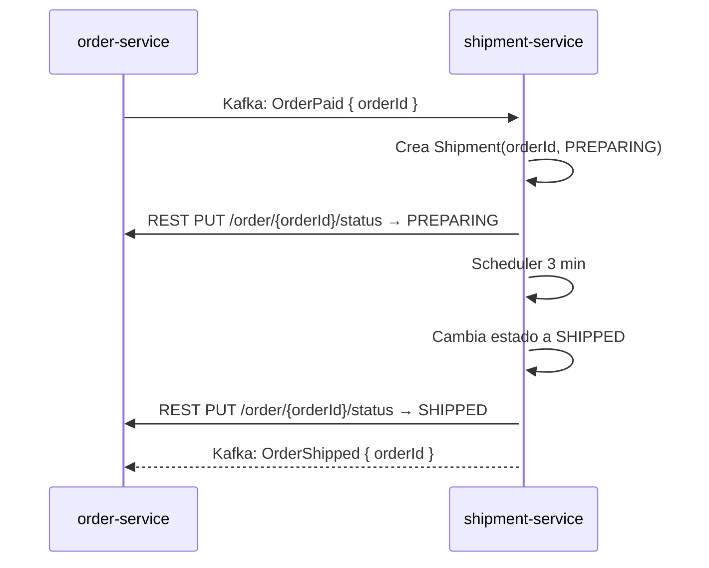

# shipment-service

Microservicio de envíos del e-commerce lab. Escrito en **Kotlin + Spring Boot 4.0.6**.

## Responsabilidad

Gestionar el ciclo de vida de los envíos desde que una orden es pagada hasta que se marca como enviada.

## Relación Order ↔ Shipment

**1 orden = 1 envío.** El `id` del shipment es el **mismo `orderId`** que llega desde order-service.
No se usa ID autogenerado. Se setea manualmente.

## Comunicación

| Tipo | Tecnología | Hacia | Detalle |
|---|---|---|---|
| Kafka (consumer) | Kafka | order-service → shipment | Escucha `OrderPaid` para iniciar envío |
| Kafka (consumer) | Kafka | order-service → shipment | Escucha `OrderCreated` (solo log) |
| Kafka (producer) | Kafka | shipment → order-service | Produce `OrderShipped` cuando el envío se completa |
| REST (client) | WebClient | shipment → order-service | `PUT /order/:orderId/status` para actualizar estado de la orden |

## Endpoints REST

| Método | Endpoint | Descripción |
|---|---|---|
| `GET` | `/api/shipment/{orderId}` | Obtener envío por orderId |
| `GET` | `/api/shipment` | Listar todos los envíos (admin/debug) |
| `POST` | `/api/shipment` | Forzar creación manual de un envío |
| `PUT` | `/api/shipment/{orderId}/status` | Actualizar estado manualmente |

## Flujo de envío

## Stack

- **Kotlin 2.2.21** + **Spring Boot 4.0.6**
- **Spring Data JPA** + PostgreSQL
- **Spring Kafka** (consumer & producer)
- **WebClient** (REST hacia order-service)
- **Scheduler** (@Scheduled o delay reactivo)
